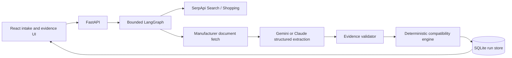

# FitProof

**Know before you buy.**

FitProof investigates whether an exact RAM module fits an exact laptop configuration. It discovers manufacturer evidence through SerpApi, extracts typed specifications with a swappable AI provider, runs deterministic compatibility checks, and shows every conclusion with inspectable source evidence.

This repository is the isolated FitProof MVP inside the COVATA workspace. COVATA's existing application is preserved in the parent directory.

## What works

- A guided laptop RAM intake for model, installed modules, free slots, upgrade action and an optional exact SKU.
- A bounded LangGraph investigation with explicit stages: validation, device evidence, offer discovery, part evidence, audit, follow-up and checks.
- SerpApi Google Search and Google Shopping Light adapters with locale-aware parameters, retries, a 12-request budget and SQLite response cache.
- Manufacturer-only source fetching for automatic specification evidence, with redirects, size limits and private-address checks.
- Gemini JSON-schema extraction or Claude Messages extraction behind one provider abstraction.
- Evidence validation: exact subject, source excerpt, supported value and manufacturer relationship are checked before a fact can drive a positive result.
- Deterministic checks for identity, DDR generation, form factor, capacity, slots, ECC, voltage, buffering, speed profile and documented restrictions.
- `CONFLICT_FOUND`, `NEEDS_INFORMATION`, `MATCHES_CHECKED_SPECIFICATIONS` and manufacturer-listed states; no compatibility guarantee is invented.
- React results UI, live SSE progress, candidate cards, “Why rejected?” evidence drawer, source links, configuration re-check and Markdown report export.
- SQLite persistence for runs, searches, sources, facts, offers, checks, events and query cache. Restarted runs are marked interrupted rather than left falsely running.
- An explicitly labelled recorded T480 replay so the full demo works without provider keys. Replay is not presented as live search.

## Run locally

Requirements: Python 3.12+, `uv`, Node.js 20+, and npm.

From this directory:

```bash
cp .env.example .env
cd backend
uv sync --frozen
uv run uvicorn app.main:app --host 127.0.0.1 --port 8017 --reload
```

In another terminal:

```bash
cd frontend
npm install
npm run dev
```

Open <http://127.0.0.1:5177>. The backend API documentation is at <http://127.0.0.1:8017/api/docs>.

### Docker Compose

From this directory, `docker compose up --build` serves the UI at <http://127.0.0.1:5177> and the API at <http://127.0.0.1:8017>. The `data/` directory is mounted for SQLite persistence. Compose reads provider variables from the shell or a local `.env` file.

### Recorded demo without keys

Leave `SERPAPI_KEY`, `LLM_API_KEY` and `LLM_MODEL` empty. The live button remains disabled deliberately. Click **Try the ThinkPad T480 example**. The replay uses short excerpts downloaded from Lenovo and Kingston manufacturer pages and separately stored, human-reviewed extraction fixtures. It performs no live SerpApi or AI call and shows that fact in the UI and report.

### Live mode

Set these values in the backend-visible `fitproof/.env`:

```env
SERPAPI_KEY=your_serpapi_key
LLM_PROVIDER=gemini
LLM_API_KEY=your_provider_key
LLM_MODEL=your_model_id
```

For Claude, use `LLM_PROVIDER=claude` and the model ID available to your account. Keys stay on the backend; the frontend never receives them. Restart Uvicorn after changing `.env`. `/api/health` exposes only readiness booleans and missing variable names.

The first live check should be one exact T480 model and one exact part. Verify that Search discovers an authoritative source, Shopping returns usable candidates, and the evidence-to-check path works before expanding model coverage. Current prices and availability are observations, not promises.

## Verify

```bash
cd backend
uv run pytest -q
uv run ruff check app tests
cd ../frontend
npm run build
```

The backend tests use mocked provider responses, downloaded manufacturer excerpts as clearly labelled replay fixtures, and deterministic compatibility cases. They never require a live SerpApi or LLM key.

## Architecture



AI extracts facts and proposes focused follow-up queries. Python rules decide pass, conflict or unknown. A source excerpt without a validated exact subject cannot create a trusted fact.

## Repository map

- `backend/app/services/serpapi/`: provider adapter, locale, retries, quota and secret scrubbing.
- `backend/app/services/evidence/`: safe document retrieval, extraction and provenance validation.
- `backend/app/services/extraction/`: Gemini/Claude adapter and explicit replay extractor.
- `backend/app/services/compatibility/`: independent deterministic rules.
- `backend/app/services/investigation/`: LangGraph runner and run manager.
- `backend/app/db/`: SQLite normalized tables and query cache.
- `backend/app/routers/`: run, SSE, clarification, offer and report endpoints.
- `frontend/src/components/`: intake, progress, results and evidence drawer.
- `docs/`: architecture, API, evidence model, compatibility rules, hackathon disclosure and demo script.

## Scope and limitations

The MVP supports laptop RAM only. It does not inspect a physical device, purchase a product, certify installation, guarantee stock, infer an unknown SKU, or claim that two URLs are independent evidence. A “matches checked specifications” result covers only documented checks and the user-provided configuration. Add SSDs, chargers, batteries, broader device categories or continuous monitoring only after the RAM workflow has real-source evaluation.

## Hackathon disclosure

The project is intended for the SerpApi India Hackathon 2026 Commerce & Market Intelligence track. Runtime AI and development tools must be filled with the actual provider/model and tools used by the team before submission. Existing COVATA code is not part of this isolated FitProof implementation; the repository should disclose any copied or pre-existing component honestly.
# fitproof
